# SonarQube Integration with GitHub Actions

## Overview

This guide provides step-by-step instructions for integrating SonarQube with GitHub Actions to perform automated code quality and security analysis on your repository.

---

## Table of Contents

1. [Prerequisites](#prerequisites)
2. [SonarQube Project Setup](#sonarqube-project-setup)
3. [GitHub Repository Configuration](#github-repository-configuration)
4. [GitHub Actions Workflow Setup](#github-actions-workflow-setup)
5. [Triggering and Verifying Analysis](#triggering-and-verifying-analysis)
6. [Reviewing Results](#reviewing-results)

---

## Prerequisites

- Access to a SonarQube instance (e.g., https://sonar.tekbay.click)
- A GitHub repository with appropriate permissions
- Basic understanding of GitHub Actions workflows

---

## SonarQube Project Setup

### Step 1: Login to SonarQube

Navigate to your SonarQube instance and log in with your credentials.

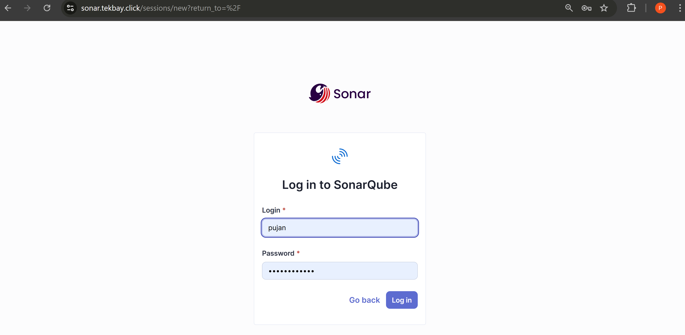

### Step 2: Create a Local Project

Once logged in, create a new local project for your repository.

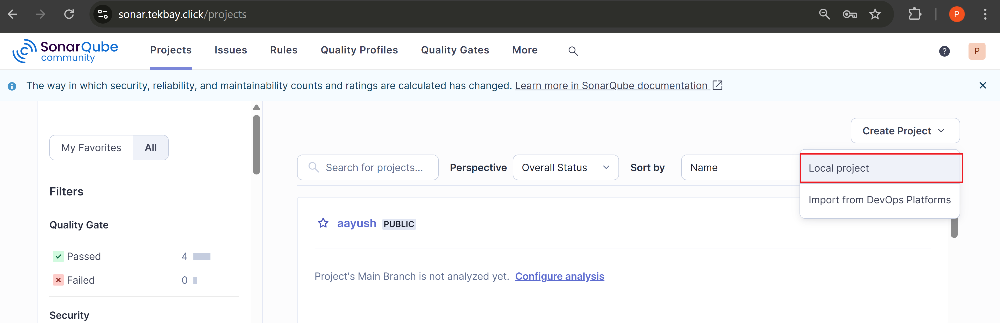

### Step 3: Enter Project Details

Provide the necessary project information including:
- Project display name
- Project key
- Main branch name

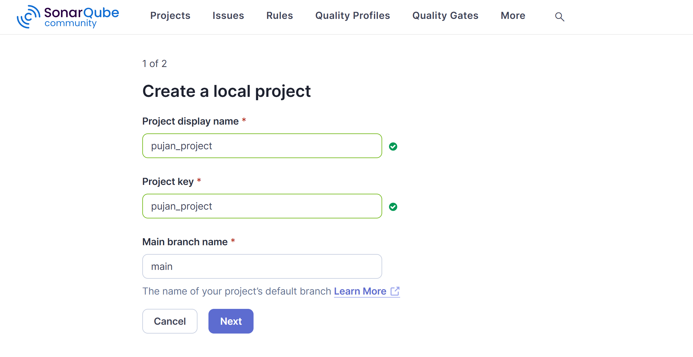

### Step 4: Configure Global Settings

For this setup, select the option to **Use the Global Setting** for your project configuration.

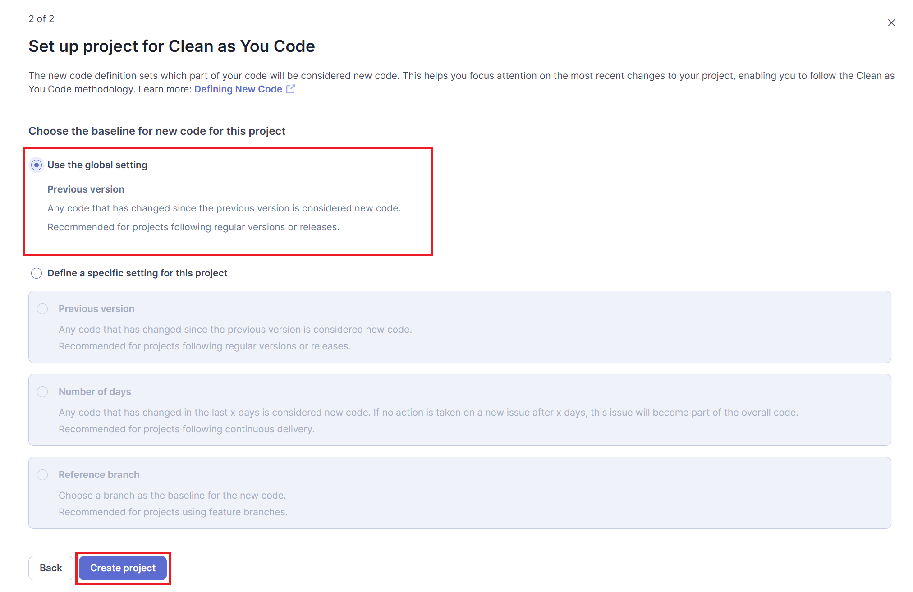

### Step 5: Select Analysis Method

Choose the analysis method for your project. Since we're integrating with GitHub Actions, select **GitHub Actions** as the analysis method.

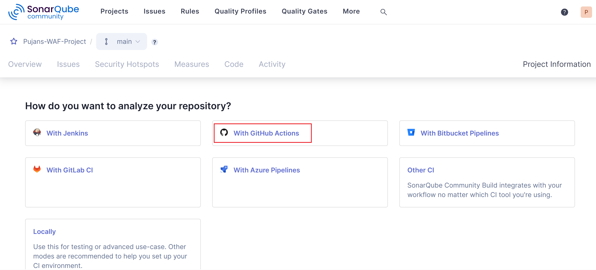

---

## GitHub Repository Configuration

### Step 6: Configure GitHub Secrets

SonarQube requires two secrets to be configured in your GitHub repository for secure authentication and communication.

#### Navigate to Repository Settings

1. Go to your GitHub repository
2. Click on **Settings**
3. Navigate to **Secrets and variables** > **Actions**
4. Click on **New repository secret**

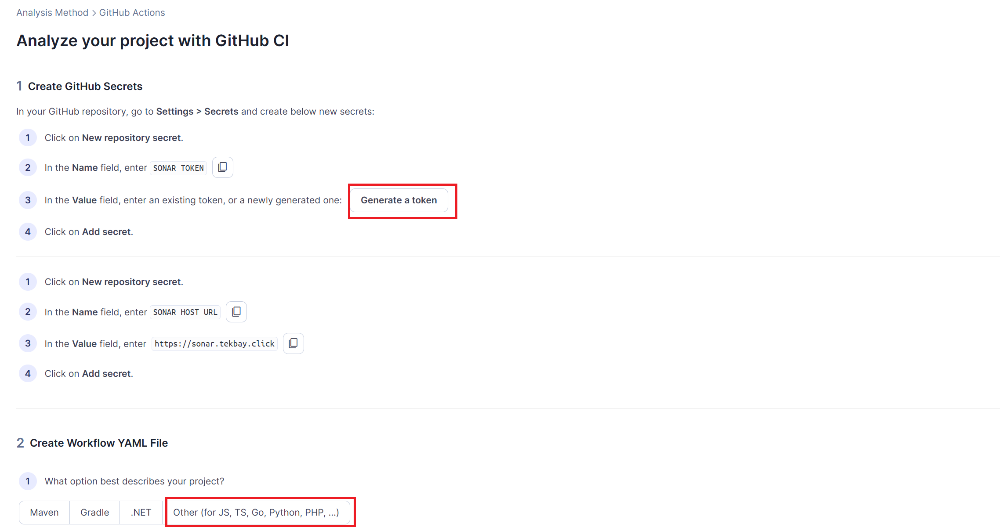

#### Add SONAR_TOKEN Secret

1. Click on **New repository secret**
2. In the **Name** field, enter: `SONAR_TOKEN`
3. In the **Value** field, enter your SonarQube token (generate a new one if needed)
4. Click **Add secret**

#### Add SONAR_HOST_URL Secret

1. Click on **New repository secret** again
2. In the **Name** field, enter: `SONAR_HOST_URL`
3. In the **Value** field, enter: `https://sonar.tekbay.click`
4. Click **Add secret**

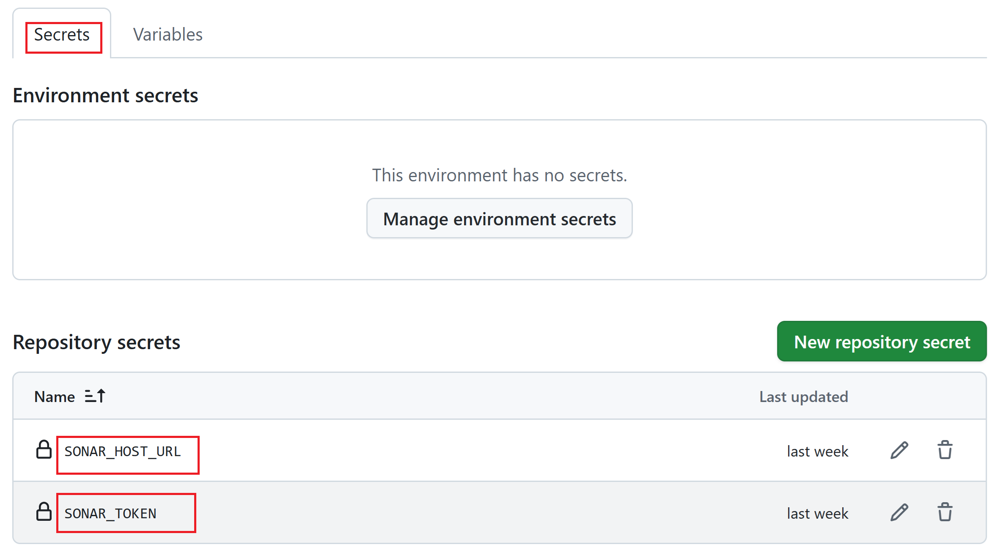

---

## GitHub Actions Workflow Setup

### Step 7: Select Project Type

Choose the option that best describes your project:
- Maven
- Gradle
- .NET
- **Other** (for JS, TS, Go, Python, PHP, etc.)

For most non-Java projects, select **Other**.

### Step 8: Create Workflow File

Create or update the workflow file in your repository at `.github/workflows/build.yaml` with the SonarQube analysis configuration provided by the setup wizard.

The workflow file should include:
- Checkout action
- SonarQube scan action with appropriate parameters
- Reference to the secrets configured earlier

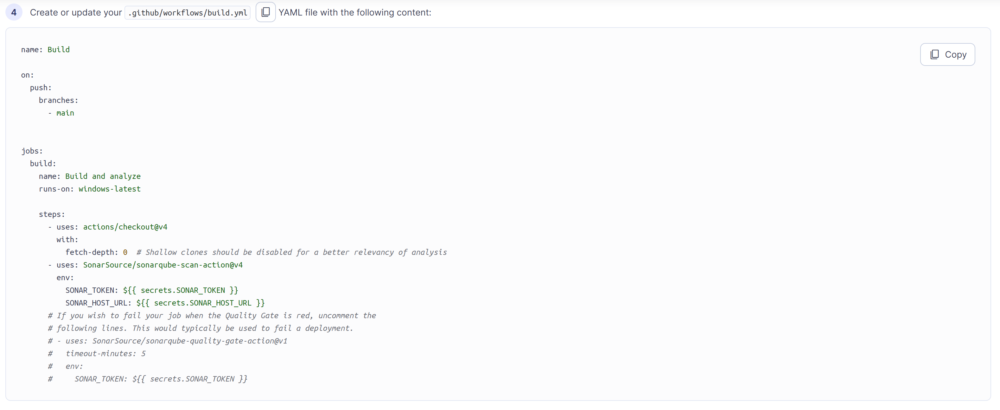

**/.github/workflows/build.yaml:**

```yaml
name: Build

on:
  push:
    branches:
      - main


jobs:
  build:
    name: Build and analyze
    runs-on: ubuntu-latest
    
    steps:
      - uses: actions/checkout@v4
        with:
          fetch-depth: 0  # Shallow clones should be disabled for a better relevancy of analysis
      - uses: SonarSource/sonarqube-scan-action@v4
        env:
          SONAR_TOKEN: ${{ secrets.SONAR_TOKEN }}
          SONAR_HOST_URL: ${{ secrets.SONAR_HOST_URL }}
      # If you wish to fail your job when the Quality Gate is red, uncomment the
      # following lines. This would typically be used to fail a deployment.
      # - uses: SonarSource/sonarqube-quality-gate-action@v1
      #   timeout-minutes: 5
      #   env:
      #     SONAR_TOKEN: ${{ secrets.SONAR_TOKEN }}
```

### Step 9: Commit and Push

Commit the workflow file and push it to your GitHub repository. This will trigger the GitHub Actions workflow automatically.

---

## Triggering and Verifying Analysis

### Step 10: Monitor GitHub Actions

Once you push the code, GitHub Actions will be triggered automatically. You can monitor the workflow execution in the **Actions** tab of your repository.

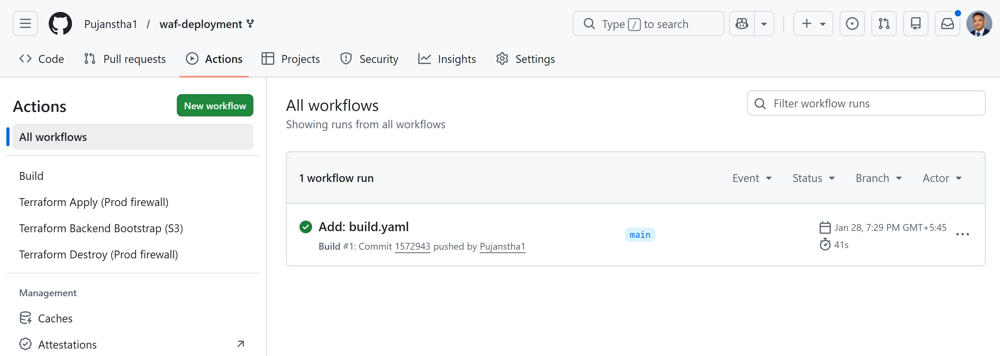

---

## Reviewing Results

### Step 11: View Analysis Results in SonarQube

After the GitHub Actions workflow completes successfully, log in to your SonarQube instance to review the analysis results.

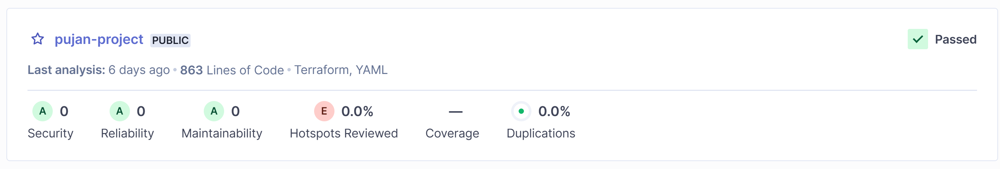

### Step 12: Review Detailed Metrics

Navigate through the project dashboard to view detailed metrics including:
- Code coverage
- Code smells
- Bugs
- Vulnerabilities
- Duplications
- Technical debt

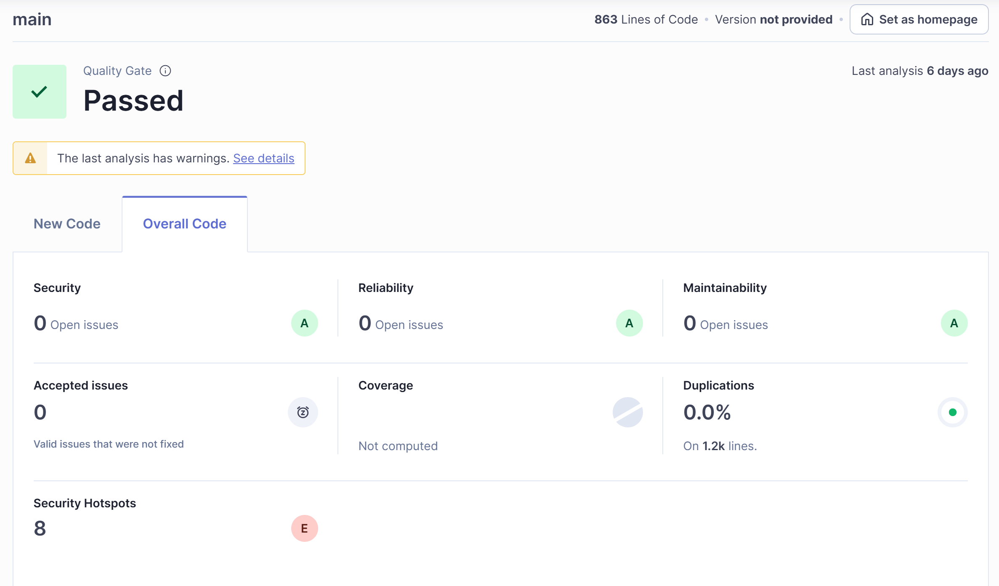

### Step 13: Check Security Hotspots

SonarQube identifies potential security vulnerabilities and provides best practice recommendations. Review the **Security Hotspots** section to address any security concerns.

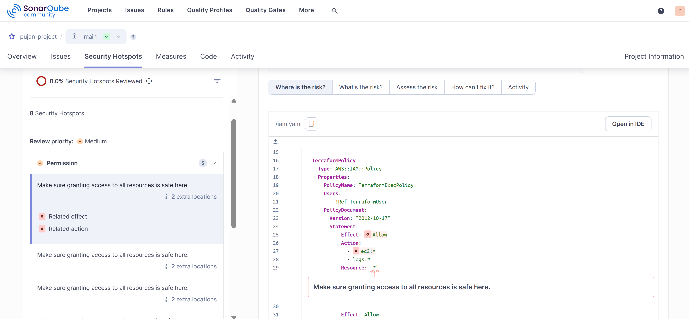

---

## Best Practices

- **Regular Scans**: Configure the workflow to run on every push and pull request
- **Quality Gate**: Set up quality gates in SonarQube to enforce code quality standards
- **Review Security Hotspots**: Regularly review and address security hotspots
- **Track Technical Debt**: Monitor and reduce technical debt over time
- **Branch Analysis**: Consider enabling branch analysis for feature branches

---

## Troubleshooting

### Common Issues

**Workflow Fails with Authentication Error**
- Verify that `SONAR_TOKEN` and `SONAR_HOST_URL` secrets are correctly configured
- Ensure the token has not expired

**Analysis Not Appearing in SonarQube**
- Check the GitHub Actions logs for errors
- Verify network connectivity to the SonarQube instance
- Confirm the project key matches in both workflow and SonarQube

**Permission Denied Errors**
- Ensure the SonarQube token has appropriate permissions
- Verify repository settings allow GitHub Actions to run

---

## Additional Resources

- [SonarQube Documentation](https://docs.sonarqube.org/)
- [GitHub Actions Documentation](https://docs.github.com/en/actions)
- [SonarQube GitHub Action](https://github.com/SonarSource/sonarqube-scan-action)

---

## Conclusion

You have successfully integrated SonarQube with GitHub Actions. Your repository will now automatically run code quality and security analysis on every push, helping maintain high code standards and identify potential issues early in the development cycle.
